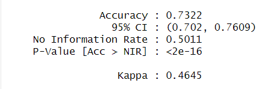
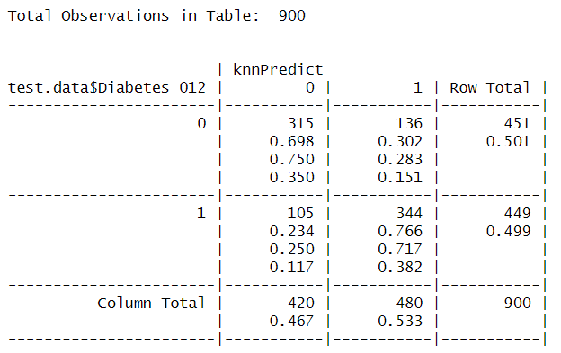
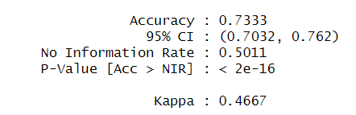
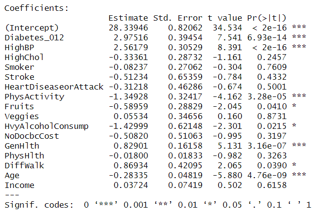

```{r, include=FALSE}
knitr::opts_chunk$set(echo = TRUE)
```

## Introduction

We will evaluate the outcomes achieved when using the KNN, linear regression, and multilinear regression models with the "diabetes_012.csv" data set annexed to this project. The aim is to select the most suitable model based on the exercise's criteria or specifications.

Summary of the variables in the "diabetes_012.csv" data set:

**Diabetes_012: 0** = no diabetes 1 = prediabetes 2 = diabetes\
**HighBP:0** = no high BP 1 = high BP\
**HighChol:** 0 = no high cholesterol 1 = high cholesterol\
**CholCheck:** 0 = no cholesterol check in 5 years 1 = yes cholesterol check in 5 years\
**BMI:** Body Mass Index\
**Smoker:** Have you smoked at least 100 cigarettes in your entire life? [Note: 5 packs = 100 cigarettes] 0 = no 1 =yes\
**Stroke:** (Ever told) you had a stroke. 0 = no 1 = yes\
**HeartDiseaseorAttack**: coronary heart disease (CHD) or myocardial infarction (MI) 0 = no 1 = yes\
**PhysActivity:** physical activity in past 30 days - not including job 0 = no 1 = yes\
**Fruits:** Consume Fruit 1 or more times per day 0 = no 1 = yes\
**Veggies:** Consume Vegetables 1 or more times per day 0 = no 1 = yes\
**HvyAlcoholConsump:** (adult men \>=14 drinks per week and adult women\>=7 drinks per week) 0 = no 1 = yes\
**AnyHealthcare:** Have any kind of health care coverage, including health insurance, prepaid plans such as HMO, etc. 0 = no 1 = yes\
**NoDocbcCost:** Was there a time in the past 12 months when you needed to see a doctor but could not because of cost? 0 = no 1 = yes\
**GenHlth:** Would you say that in general your health is: scale 1-5 1 = excellent 2 = very good 3 = good 4 = fair 5 =poor\
**MentHlth:** days of poor mental health scale 1-30 days\
**PhysHlth:** physical illness or injury days in past 30 days scale 1-30\
**DiffWalk:** Do you have serious difficulty walking or climbing stairs? 0 = no 1 = yes\
**Sex:** 0 = female 1 = male\
**Age:** 13-level age category (\_AGEG5YR see codebook) 1 = 18-24 9 = 60-64 13 = 80 or older\
**Education:** Education level (EDUCA see codebook) scale 1-6 1 = Never attended school or only kindergarten 2 =elementary etc.\
**Income:** Income scale (INCOME2 see codebook) scale 1-8 1 = less than \$10,000 5 = less than \$35,000 8 =\$75,000 or more

###### For more information about the dataset, please refer to: <https://www.kaggle.com/datasets/alexteboul/diabetes-health-indicators-dataset>

## First part Data exploration and data wrangling

First, we load all the necessary libraries for model creation and data analysis:

```{r, include=FALSE}
library(tidyverse)
library(dplyr)
library(caret)
library(class)
library(gmodels)
library(psych)
```

library(**tidyverse**)\
library(**dplyr**)\
library(**caret**)\
library(**class**)\
library(**gmodels**)\
library(**psych**)

Then load the data set that was previously downloaded

```{r}
folder <- dirname(rstudioapi::getSourceEditorContext()$path)
parentFolder <- dirname (folder)
data <- read.csv(paste0(folder,"/diabetes_012.csv"))
```

so:

1.  **`folder <- dirname(rstudioapi::getSourceEditorContext()$path)`**: Retrieves the current script's directory location.

2.  **`parentFolder <- dirname(folder)`**: Obtains the parent directory of the current directory.

3.  **`data <- read.csv(paste0(parentFolder,"/diabetes_012.csv"))`**: Reads a CSV file named "diabetes_012.csv" located in the "Data-set" directory, which is the parent directory, and loads the data into the **`data`** variable.

```{r}
data$Diabetes_012 <- ifelse(data$Diabetes_012 == 0, 0, 1)
set.seed(13)

data_ <- data[sample(nrow(data), 3000), ]

Prop_Data <- data.frame(Diabetes = c(prop.table(table(data_$Diabetes_012))),
                      Sex = c(prop.table(table(data_$Sex))),
                      Smoker = c(prop.table(table(data_$Smoker))),
                      CholCheck= c(prop.table(table(data_$CholCheck))))

Prop_Data <- Prop_Data %>% mutate(across(everything(), ~.*100))
print(Prop_Data)
```

-   In this part we convert the variable "Diabetes_012" into a binary variable where 0 represents the absence of diabetes and 1 represents the presence of diabetes in the data set. We set a random seed to ensure reproducibility of the results and alignment with the report. In addition, we created a table representing the proportion of the data set of the variables reported in a sample of 3000 (1% percent) of the total data in percent.

Based on these data, it is possible to conclude that it is very likely that the majority of individuals in our sample are women who do not smoke. However, it is anticipated that the proportion of individuals who have received cholesterol checks in the last 5 years will be significantly higher. This will provide us with an initial perspective on our data set, which will be useful in interpreting future results.

```{r}
pairs.panels(data_ [c("Age", "BMI", "Education", "GenHlth")],
             pch = 21,
             bg = c("blue", "red")[unclass(data_$Diabetes_012)])
```

The **`pairs.panels`** code is used to create a matrix of scatter-plots and histograms that display the relationships between selected variables and their distributions. Here's a detailed explanation of the code:

-   **`data_[c("Age", "BMI", "Education", "GenHlth")]`**: Selects the columns "Age," "BMI" (Body Mass Index), "Education," and "GenHlth" (General Health) from the data set **`data_`**.

-   **`pch = 21`**: Sets the point type in the scatter-plots. In this case, it uses a circle-shaped point with a border.

-   **`bg = c("red", "green3", "blue", "orange", "yellow")[unclass(data_$Diabetes_012)]`**: Defines the background color of the points based on the "Diabetes_012" variable. Points will be colored based on whether the "Diabetes_012" variable is 0 or 1.

Regarding observations about the distributions:

-   The variable **"Age"** exhibits a normal distribution, which implies that the age values are dispersed approximately evenly around the mean. This property may be relevant in certain statistical analyses, since some methods are based on the assumption that the data follow a normal distribution.

-   Body Mass Index **(BMI)** has a left-skewed distribution, indicating that BMI values tend to cluster at the lower end. This suggests that most of the observations in the sample have lower BMI values, reflecting a concentration of individuals with a lower BMI.

## Second part KNN MODEL

*Note: Only can view code in this first exercise, for view all code you can open "Training_Knn_Ml.R" in this same folder.*

### KNN models for predicting diabetes

```{r}
set.seed(13)
stratified_data <- data %>% group_by(Diabetes_012) %>%
                                sample_n(1500, replace = TRUE) %>%
                                ungroup()
sample.index <- sample(1:nrow(stratified_data)
                       ,nrow(stratified_data)*0.7
                       ,replace = F)
Predictions <- c("HighBP", "HighChol","Fruits", "Veggies", 
                 "CholCheck", "BMI", "Smoker", "Stroke",
                 "HeartDiseaseorAttack", "PhysActivity", 
                 "HvyAlcoholConsump", "AnyHealthcare", 
                 "NoDocbcCost", "GenHlth", "MentHlth", 
                 "PhysHlth", "DiffWalk", "Sex",
                 "Age", "Education", "Income")

# Original data
train.data <- stratified_data[sample.index, c(Predictions, "Diabetes_012"), drop = FALSE]
test.data <- stratified_data[-sample.index, c(Predictions, "Diabetes_012"), drop = FALSE]
train.data$Diabetes_012 <- factor(train.data$Diabetes_012)
test.data$Diabetes_012 <- factor(test.data$Diabetes_012)
```

The first step would be the data preparation, in this case we are going to use all variables except Diabetes clearly

**set.seed(**13**):** Set a fixed random seed for reproducibility.\
**stratified_data:** Stratifies the data by the variable "Diabetes_012" and creates balanced subsets.\
**sample.index:** Randomly selects **70%** of the data for training.\
**Predictions:** Lists predictor variables for analysis.\
**train.data:** Creates the training data set with the selected predictors and "Diabetes_012" as factor.\
**test.data:** Creates the test data set in a similar fashion.

This code prepares the data for machine learning by splitting it into training and test sets and selecting the relevant predictor variables for analysis. It also ensures that the analysis results are reproducible thanks to the fixed random seed.

```{r}
Control <- trainControl(method = "cv", p = 0.7)
KnnTry <- train(Diabetes_012 ~ .
                , data = train.data
                , method = "knn", trControl = Control
                , preProcess = c("range") # c("center", "scale") for z-score
                , tuneLength = 20)

plot(KnnTry)
```

1.  The model is trained using the training data (**`train.data`**), and it specifies that the target variable is "Diabetes_012," and all other available predictor variables ("." indicates all predictor variables).

2.  **trainControl:** Here, control parameters for model training are set. It uses cross-validation (**`method = "cv"`**) with a 70% data partition for training (**`p = 0.7`**).

3.  **Train:** This function trains the k-NN model using the specified parameters. It uses the training data together with the "knn" method and the control parameters previously defined. It also performs a preprocessing step to normalize the data to the specified range. The value of the **tuneLength** parameter is set to 50, which means that 50 iterations will be executed to determine the optimal value of k.

4.  **plot(knnTry):** Finally, this line of code generates a plot that shows the performance of the trained k-NN model.

```{r, include=FALSE}
# Make Predictions
knnPredict <- predict(KnnTry, newdata = test.data)
# Creates the confusion matrix
confusionMatrix(data = knnPredict, reference = test.data$Diabetes_012)

```

{width="249"}

In this code segment, we perform forecasts using the previously trained model known as k-Nearest Neighbors (k-NN) and then evaluate its performance. To compute the optimal value of K in this model, we make use of the "caret" library. This choice is based on the search for greater accuracy in the model.

1.  **Make predictions:** The **`predict`** function is used to make predictions on new data. In this case, we're applying the trained k-NN model (**`knnFit`**) to the test data (**`test.data`**) to predict the values of the "Diabetes_012" variable for the test data set. These predictions are stored in the **`knnPredict`** variable.

2.  **Creates the confusion matrix:** The **`confusionMatrix`** function is used to create a confusion matrix to evaluate the performance of the k-NN model's predictions. It takes two arguments:

    **`data`**: The vector of predicted values (**`knnPredict`**).

    **`reference`**: The true values of the target variable from the test data (**`test.data$Diabetes_012`**). It's used as a reference to calculate metrics like accuracy, precision, recall, etc.

    **Accuracy:** The accuracy of the model is **73.22%**, indicating that 73.22% of the predictions made by the model are correct. This metric measures the overall correctness.\
    **Kappa Index**: The Kappa index (Kappa) is a measure of inter-rater agreement, in this case, the agreement between model predictions and actual classes. It adjusts the accuracy for the possibility of random agreement and takes values between -1 and 1. In this case, Kappa is 0.4645.

    A Kappa of 1 indicates perfect agreement.\
    A Kappa of 0 indicates agreement equivalent to random agreement.\
    A Kappa of less than 0 indicates agreement worse than chance.

    In this case, a Kappa of **0.4645** indicates moderate agreement between model predictions and actual classes. It suggests that the model performance is better than chance, but that there is room for improvement.

The **cross table** provides a summary of the model's performance in classifying instances into two classes (0 and 1), where:

The rows represent the predicted classes (0 and 1).\
The columns represent the actual or reference classes (0 and 1).\
The four values of the matrix are

**True Negative (TN)**: 315 - Instances correctly predicted as 0 (no diabetes).\
**False Positives (FP)**: 136 - Instances incorrectly predicted as 1 (diabetes).\
**False Negatives (FN)**: 105 - Instances incorrectly predicted as 0 (no diabetes).\
**True Positives (TP)**: 344 - Instances correctly predicted as 1 (diabetes).

```{r, include=FALSE}
# CrossTable
CrossTable(x = test.data$Diabetes_012,  y = knnPredict, prop.chisq = F)
```

{width="364"}

### Second model

```{r, include=FALSE}
Predictions_remove <- c("AnyHealthcare", "NoDocbcCost", "DiffWalk", "Education", "Income")
train.data2 <- train.data[, !(names(train.data) %in% Predictions_remove)]
test.data2 <- test.data[, !(names(test.data) %in% Predictions_remove)]

Control <- trainControl(method = "cv", number = 5)
KnnTry_2 <- train(Diabetes_012 ~ .
                 , data = train.data2
                 , method = "knn", trControl = Control
                 , preProcess = c("range") # c("center", "scale") for z-score
                 , tuneLength = 20)
```

```{r}
plot(KnnTry_2)
```

In this code:

-   **`predictors_to_remove`** is a vector containing the names of predictors (features) that are to be removed from the data set.

-   **`train.data2`** and **`test.data2`** are created by sub setting the original **`train.data`** and **`test.data`** data sets, respectively, to remove the predictors listed in **`predictors_to_remove`**.

The code essentially removes five predictors ("AnyHealthcare," "NoDocbcCost," "DiffWalk," "Education," and "Income") from the training and testing data sets.

this code removes specific predictors from the data set and trains a k-NN model on the modified data with **5-fold cross-validation** while tuning the hyper-parameter (k) using a range of values to optimize the model's performance.

```{r, include=FALSE}
# Make Predictions
knnPredict2 <- predict(KnnTry, newdata = test.data)
# Creates the confusion matrix
confusionMatrix(data = knnPredict, reference = test.data$Diabetes_012)
```

{width="257"}

**Accuracy:** The accuracy of the model is **73.33%**, indicating that 73.33% of the predictions made by the model are correct. This metric measures overall correctness.\
**Kappa:** The Kappa value is **0.4668**, indicating moderate agreement between the model's predictions and the actual classes. It suggests that the model's performance is better than random chance, but there is still room for improvement. A higher Kappa value would indicate stronger agreement.\
**Sensitivity:** Sensitivity, also known as the True Positive Rate or Recall, is **67.85%**. It represents the proportion of actual positive cases (diabetes) correctly predicted by the model.\
**Specificity:** Specificity is **78.84%**, indicating the proportion of actual negative cases (no diabetes) correctly predicted by the model.\
**Positive Predictive Value** (Pos Pred Value): Pos Pred Value is **76.31%**, which represents the probability that a predicted positive case is truly positive.\
**Negative Predictive Value** (Neg Pred Value): Neg Pred Value is **70.94%**, indicating the probability that a predicted negative case is truly negative.\
**Prevalence**: Prevalence is **50.11%**, representing the proportion of actual positive cases in the dataset.\
**Detection Rate**: Detection Rate is **34%**, indicating the proportion of true positive cases detected by the model.\
**Detection Prevalence**: Detection Prevalence is **44.56%**, representing the proportion of the dataset predicted as positive by the model.\
**Balanced Accuracy**: Balanced Accuracy is **73.35%**, which takes into account both sensitivity and specificity and provides a balanced measure of model performance.

```{r, include=FALSE}
CrossTable(x = test.data2$HeartDiseaseorAttack, y = knnPredict2
           , prop.chisq = F)
```

The confusion matrix provides a summary of the model's performance in classifying instances into two classes, 0 and 1. Here's what each part of the matrix represents:

**True Negative (TN):** 306 - Instances correctly predicted as 0 (no diabetes).\
**False Positives (FP):** 145 - Instances incorrectly predicted as 1 (diabetes).\
**False Negatives (FN):** 95 - Instances incorrectly predicted as 0 (no diabetes).\
**True Positives (TP):** 354 - Instances correctly predicted as 1 (diabetes).

In summary, the confusion matrix together with the related metrics provide details about how the model performs in classifying instances into two categories, 0 (no diabetes) and 1 (diabetes). The performance of the model is acceptable, although there is room for improvement with the goal of achieving a higher Kappa value, which would indicate greater consistency between the predictions and the actual classes.

### Third experiment

```{r, include=FALSE}
Predictions_remove2 <- c("BMI", "MentHlth","PhysHlth", "Income", "Veggies")
train.data3 <- train.data2[, !(names(train.data2) %in% Predictions_remove2)]
test.data3 <- test.data2[, !(names(test.data2) %in% Predictions_remove2)]

Control2 <- trainControl(method = "repeatedcv", number = 10, repeats = 3)
KnnTry_3 <- train(Diabetes_012 ~ .
                 , data = train.data3
                 , method = "knn", trControl = Control2
                 , preProcess = c("range") # c("center", "scale") for z-score
                 , tuneLength = 20)
```

```{r}
plot(KnnTry_3)
```

In this part of the code, cross-validation is performed with 10 folds (specified by **`number = 10`**) and repeated 3 times (specified by **`repeats = 3`**). This approach is known as "repeated cross-validation" and is used to obtain a more robust estimate of model performance by repeatedly splitting the data into training and testing sets and averaging the results.

The "**boot"** method or Bootstrap resampling is a technique that involves sampling with replacement of the training data to create multiple training data sets, and then training the model on each of these sets. The performance of the model is then evaluated on test data for each Bootstrap training data set.

```{r, include=FALSE}
# Make Predictions
knnPredict3 <- predict(KnnTry_3, newdata = test.data3)
# Creates the confusion matrix
confusionMatrix(data = knnPredict3, reference = test.data3$Diabetes_012)
```

Model 3:

-   **Accuracy: 74.67%**

-   **Kappa: 0.4935**

Conclusions:

-   Model 3, which was built using the predictors selected in **`train.data3`**, performs the best among all the models. It has the highest accuracy of 74.67% and the highest Kappa of 0.4935. This indicates that Model 3 is better at correctly classifying instances into either class 0 (no diabetes) or class 1 (diabetes).

-   Model 1, Model 2,growth is evidenced in accuracy and Kappa until Model 3, with differences that are not substantial. have a average of 73.76% and Kappa around 0.4749. This suggests that the predictors selected in **`train.data2`** (Model 1 and Model 2) are not significantly different in terms of predictive power.

-   The Kappa statistic is a measure of agreement between the model's predictions and the actual classes. A higher Kappa value indicates better agreement beyond chance, which suggests a more reliable model.

Overall, Model 3 (with the predictors chosen in **train.data3**) is preferred due to its higher accuracy and Kappa value. The choice of model is based on the importance of finding an optimal balance between accuracy and reliability when making predictions.

## KNN Models and Experiments to Find HeartDiseaseorAttack

**Model 1**:

```{r, include=FALSE}
## selection of 1500 samples of each factor of the dataset#
set.seed(13)
stratified_data <- data %>%
  group_by(HeartDiseaseorAttack) %>%
  sample_n(1500, replace = TRUE) %>%
  ungroup()

Predictions <- c("HighBP", "HighChol", "CholCheck", "BMI", "Smoker", "Stroke", "Diabetes_012", "PhysActivity", "Fruits", "Veggies", "HvyAlcoholConsump", "AnyHealthcare", "NoDocbcCost", "GenHlth", "MentHlth", "PhysHlth", "DiffWalk", "Sex", "Age", "Education", "Income")

# Original data
train.data <- stratified_data[sample.index, c(Predictions, "HeartDiseaseorAttack"), drop = FALSE]
test.data <- stratified_data[-sample.index, c(Predictions, "HeartDiseaseorAttack"), drop = FALSE]

train.data$HeartDiseaseorAttack <- factor(train.data$HeartDiseaseorAttack)
test.data$HeartDiseaseorAttack <- factor(test.data$HeartDiseaseorAttack)

# Train the k-NN model
Control <- trainControl(method = "cv", p = 0.7)
KnnTry <- train(HeartDiseaseorAttack ~ .
                , data = train.data
                , method = "knn", trControl = Control
                , preProcess = c("range") # c("center", "scale") for z-score
                , tuneLength = 20)
# Make Predictions
knnPredict <- predict(KnnTry, newdata = test.data)
# Creates the confusion matrix
confusionMatrix(data = knnPredict, reference = test.data$HeartDiseaseorAttack)
```

```{r}
plot(KnnTry)
```

**Model 2**:

```{r, include=FALSE}
### second model

Predictions_remove <- c("AnyHealthcare", "NoDocbcCost", "DiffWalk", "Education", "Income")
train.data2 <- train.data[, !(names(train.data) %in% Predictions_remove)]
test.data2 <- test.data[, !(names(test.data) %in% Predictions_remove)]

# Train the k-NN model
Control <- trainControl(method = "cv", number = 5)
KnnTry_2 <- train(HeartDiseaseorAttack ~ .
                 , data = train.data2
                 , method = "knn", trControl = Control
                 , preProcess = c("range") # c("center", "scale") for z-score
                 , tuneLength = 20)
# Make Predictions
knnPredict2 <- predict(KnnTry_2, newdata = test.data2)
# Creates the confusion matrix
confusionMatrix(data = knnPredict2, reference = test.data2$HeartDiseaseorAttack)
```

```{r}
plot(KnnTry_2)
```

**Model 3**:

```{r, include=FALSE}
### Third Model
Predictions_remove2 <- c("ChoclCheck", "MentHlth","HvyAlcoholConsump", "Fruits", "Veggies")
train.data3 <- train.data2[, !(names(train.data2) %in% Predictions_remove2)]
test.data3 <- test.data2[, !(names(test.data2) %in% Predictions_remove2)]

# Train the k-NN model
Control2 <- trainControl(method = "repeatedcv", number = 10, repeats = 3)
KnnTry_3 <- train(HeartDiseaseorAttack ~ .
                 , data = train.data3
                 , method = "knn", trControl = Control2
                 , preProcess = c("range") # c("center", "scale") for z-score
                 , tuneLength = 20)
# Make Predictions
knnPredict3 <- predict(KnnTry_3, newdata = test.data3)
# Creates the confusion matrix
confusionMatrix(data = knnPredict3, reference = test.data3$HeartDiseaseorAttack)
```

```{r}
plot(KnnTry_3)
```

**Model 1**:

Accuracy: 73.89%\
Kappa: 0.4778

**Model 2**:

Accuracy: 73.22%\
Kappa: 0.4645

**Model 3**:\
Accuracy: 74.11%\
Kappa: 0.4822

Analysis:

-   Accuracy: Model 3 has the highest accuracy (74.11%), followed by Model 1 (73.89%) and Model 2 (73.22%). Accuracy measures the proportion of correct predictions in the test set.

-   Kappa: Model 3 also has the highest Kappa value (0.4822), followed by Model 1 (0.4778) and Model 2 (0.4645). Kappa evaluates the agreement between model predictions and actual classes while considering the possibility of random chance.

-   In summary, considering both accuracy and Kappa value, Model 2 seems to stand out as the best choice among the three models. Model 1 also shows good performance, while Model 3, although slightly less accurate than Model 2, stands out as the most effective, offering the highest accuracy and Kappa. Therefore, it is recommended that Model 3 be chosen as the preferred option to solve this classification problem.

## KNN Models and Experiments to Find Sex

**Model 1:**

```{r, include=FALSE}
###KNN Models and Experiments to Find Sex #####################################################################


## selection of 1500 samples of each factor of the dataset#
set.seed(13)
stratified_data <- data %>%
  group_by(Sex) %>%
  sample_n(1500, replace = TRUE) %>%
  ungroup()

Predictions <- c("HighBP", "HighChol", "CholCheck", "BMI", "Smoker", "Stroke", "HeartDiseaseorAttack" ,"Diabetes_012", "PhysActivity", "Fruits", "Veggies", "HvyAlcoholConsump", "AnyHealthcare", "NoDocbcCost", "GenHlth", "MentHlth", "PhysHlth", "DiffWalk", "Age", "Education", "Income")

# Original data
train.data <- stratified_data[sample.index, c(Predictions, "Sex"), drop = FALSE]
test.data <- stratified_data[-sample.index, c(Predictions, "Sex"), drop = FALSE]

train.data$Sex <- factor(train.data$Sex)
test.data$Sex <- factor(test.data$Sex)

# Train the k-NN model
Control <- trainControl(method = "cv", p = 0.7)
KnnTry <- train(Sex ~ .
                , data = train.data
                , method = "knn", trControl = Control
                , preProcess = c("range") # c("center", "scale") for z-score
                , tuneLength = 20)
# Make Predictions
knnPredict <- predict(KnnTry, newdata = test.data)
# Creates the confusion matrix
confusionMatrix(data = knnPredict, reference = test.data$Sex)
```

```{r}
plot(KnnTry)
```

**Model 2:**

```{r, include=FALSE}
# second model
Predictions_remove <- c("AnyHealthcare", "NoDocbcCost", "DiffWalk", "Age", "PhysActivity")
train.data2 <- train.data[, !(names(train.data) %in% Predictions_remove)]
test.data2 <- test.data[, !(names(test.data) %in% Predictions_remove)]

# Train the k-NN model
Control <- trainControl(method = "cv", number = 5)
KnnTry_2 <- train(Sex ~ .
                 , data = train.data2
                 , method = "knn", trControl = Control
                 , preProcess = c("range") # c("center", "scale") for z-score
                 , tuneLength = 20)
#Make Predictions
knnPredict2 <- predict(KnnTry_2, newdata = test.data2)
# Creates the confusion matrix
confusionMatrix(data = knnPredict2, reference = test.data2$Sex)
```

```{r}
plot(KnnTry_2)
```

**Model 3:**

```{r, include=FALSE}
### Third Model
Predictions_remove2 <- c("ChoclCheck", "MentHlth","HvyAlcoholConsump", "Fruits", "Veggies")
train.data3 <- train.data2[, !(names(train.data2) %in% Predictions_remove2)]
test.data3 <- test.data2[, !(names(test.data2) %in% Predictions_remove2)]

# Train the k-NN model
Control2 <- trainControl(method = "repeatedcv", number = 10, repeats = 3)
KnnTry_3 <- train(Sex ~ .
                 , data = train.data3
                 , method = "knn", trControl = Control2
                 , preProcess = c("range") # c("center", "scale") for z-score
                 , tuneLength = 20)
#Make Predictions
knnPredict3 <- predict(KnnTry_3, newdata = test.data3)
# Creates the confusion matrix
confusionMatrix(data = knnPredict3, reference = test.data3$Sex)
```

```{r}
plot(KnnTry_3)
```

The three models for predicting the sex of a person do not appear to be effective in this dataset. Here are the results for the three models:

**Model 1:**

Accuracy: 58.33%\
Kappa: 0.1665

**Model 2:**

Accuracy: 56.56%\
Kappa: 0.131

**Model 3:\
**Accuracy: 58.67%\
Kappa: 0.1734

Analysis:

-   The accuracy of all the models is quite low, between 54.67% to 56.56%. This means that these models are not doing a good job of predicting a person's sex based on the provided features.

-   The Kappa value shows low agreement in all models, indicating poor correspondence between model predictions and the actual gender of individuals. Kappa takes into account a concordance that exceeds what could occur at random, and these low values indicate that the models are not working effectively.

-   In summary, the models are not appropriate for making predictions about a person's gender based on the characteristics provided in this data set. This can be attributed to the complexity of the situation and the absence of an obvious relationship between characteristics and gender in this specific data set.

## **Third part**

### Linear and multilinear regression

**Model 1:**

```{r, include=FALSE}
### Linear regression model BMI #####################################################################################
set.seed(13)
stratified_data2 <- data[sample(nrow(data), 3000), ]

Predictions <- colnames(stratified_data2)[-5]
sample.index <- sample(1:nrow(stratified_data2),
                       nrow(stratified_data2) * 0.7,
                       replace = FALSE)
train.data <- stratified_data2[sample.index, c(Predictions, "BMI"), drop = FALSE]
test.data <- stratified_data2[-sample.index, c(Predictions, "BMI"), drop = FALSE]

ins_moderu <- lm(BMI ~ ., data = train.data)
summary(ins_moderu)

# Train the moderu
train.control <- trainControl(method = "cv", number = 10 )
moderu <- train(BMI ~ ., data = train.data, method = "lm",
               trControl = train.control)
# Summarize the results
print(moderu)
```

-   **Feature Selection:** The code selects all columns except the 5th column as predictors and stores them in the **`predictors`** variable. The 5th column ("BMI") is selected as the target variable for prediction.

-   **Initial Linear Regression Model:** An initial linear regression model (**`ins_model`**) is built using the training data to predict BMI based on all available predictors. A summary of this model is displayed.

-   **Data Sampling:** The code begins by setting a random seed, then randomly selects 3000 rows from the dataset and stores it in **`data_estratificada2`**.

-   **Model Training:** A linear regression model is trained using 10-fold cross-validation (**`trainControl`**) on the training data. This means the data is split into 10 subsets, and the model is trained and evaluated 10 times, each time using a different subset for validation.

-   **Results Summary:** The code prints a summary of the trained linear regression model (**`model`**).

-   **Train-Test Split:** The data is split into a training set (**`train.data`**) and a testing set (**`test.data`**) using a 70-30% split ratio. The training data will be used to build and train the linear regression model, and the testing data will be used to evaluate its performance.

Additionally, it's worth noting that no data normalization was performed in this code. Normalization was omitted because it didn't lead to improved results. Stratification of the sample was also avoided because it caused some variables, such as **`Diabetes_012`**, to behave abnormally in relation to BMI prediction. Therefore, it was decided not to stratify the sample as it did not provide meaningful improvements in this case.

**Model 2:**

```{r, include=FALSE}
#### second
Predictions_remove <- c("AnyHealthcare", "CholCheck", "MentHlth", "Education", "Sex")
train.data2 <- train.data[, !(names(train.data) %in% Predictions_remove)]
test.data2 <- test.data[, !(names(test.data) %in% Predictions_remove)]

ins_moderu <- lm(BMI ~ ., data = train.data2)
summary(ins_moderu)
# Train the moderu
train.control <- trainControl(method = "cv", number = 5)
moderu <- train(BMI ~ ., data = train.data2, method = "lm",
               trControl = train.control)
# Summarize the results
print(moderu)
```

{width="368"}

**Model 3:**

```{r, include=FALSE}
#### Third
Predictions_remove <- c("Income", "Stroke", "NoDocbcCost", "Veggies", "HvyAlcoholConsump")

train.data3 <- train.data2[, !(names(train.data2) %in% Predictions_remove)]
test.data3 <- test.data2[, !(names(test.data2) %in% Predictions_remove)]

ins_moderu <- lm(BMI ~ ., data = train.data3)
summary(ins_moderu)
# Train the moderu
train.control <- trainControl(method = "repeatedcv", number = 10, repeats = 3)
moderu <- train(BMI ~ ., data = train.data3, method = "lm",
               trControl = train.control)
# Summarize the results
print(moderu)
```

**Model 1:**

-   RMSE (Root Mean Squared Error): 5.953

-   R-squared: 0.1393

-   MAE (Mean Absolute Error): 4.277

**Model 2:**

-   RMSE (Root Mean Squared Error): 5.956

-   R-squared: 0.1368

-   MAE (Mean Absolute Error): 4.275

**Model 3:**

-   RMSE (Root Mean Squared Error): 5.931

-   R-squared: 0.142

-   MAE (Mean Absolute Error): 4.283

Comparing these models:

-   The lowest RMSE is achieved by **Model 3** (RMSE = 5.9318), indicating that it has the smallest average prediction error.

-   The highest R-squared value is also observed in **Model 3** (R-squared = 0.1423), which means it explains the most variance in the data.

-   The lowest MAE is also obtained by **Model 2** (MAE = 4.2757), indicating that it has the smallest absolute prediction errors.

According to these criteria, **Model 3** seems to stand out among the three models. It presents the lowest RMSE value, the highest R-squared and the smallest MAE, which together suggest that it offers the best predictive performance for estimating Body Mass Index (BMI).

## Linear regression model MentHlth

**Model 1**

```{r, include=FALSE}
### Linear regression model MentHlth ################################################################################
set.seed(13)
stratified_data2 <- data[sample(nrow(data), 3000), ]

Predictions <- colnames(stratified_data2)[-16]
sample.index <- sample(1:nrow(stratified_data2),
                       nrow(stratified_data2) * 0.7,
                       replace = FALSE)

### ENTRENAMIENTO
train.data <- stratified_data2[sample.index, c(Predictions, "MentHlth"), drop = FALSE]
test.data <- stratified_data2[-sample.index, c(Predictions, "MentHlth"), drop = FALSE]
ins_moderu <- lm(MentHlth ~ ., data = train.data)
summary(ins_moderu)

# Train the moderu
train.control <- trainControl(method = "cv", number = 10 )
moderu <- train(MentHlth ~ ., data = train.data, method = "lm",
               trControl = train.control)
# Summarize the results
print(moderu)
```

**Model 2**

```{r, include=FALSE}
###Second
Predictions_remove <- c("BMI", "HeartDiseaseorAttack", "Stroke", "PhysActivity", "CholCheck")

train.data2 <- train.data[, !(names(train.data) %in% Predictions_remove)]
test.data2 <- test.data[, !(names(test.data) %in% Predictions_remove)]
ins_moderu <- lm(MentHlth ~ ., data = train.data2)
summary(ins_moderu)

# Train the moderu
train.control <- trainControl(method = "cv", number = 5)
moderu <- train(MentHlth ~ ., data = train.data2, method = "lm",
               trControl = train.control)
# Summarize the results
print(moderu)
```

**Model 3**

```{r, include=FALSE}
#### Third
Predictions_remove <- c("Diabetes_012", "HighBP", "HighChol", "Veggies", "Education")

train.data3 <- train.data2[, !(names(train.data2) %in% Predictions_remove)]
test.data3 <- test.data2[, !(names(test.data2) %in% Predictions_remove)]
ins_moderu <- lm(MentHlth ~ ., data = train.data3)
summary(ins_moderu)

# Train the moderu
train.control <- trainControl(method = "repeatedcv", number = 10, repeats = 3)
moderu <- train(MentHlth ~ ., data = train.data3, method = "lm",
               trControl = train.control)
# Summarize the results
print(moderu)
```

**Model 1:**

-   RMSE (Root Mean Squared Error): 6.826

-   R-squared: 0.164

-   MAE (Mean Absolute Error): 4.094

**Model 2:**

-   RMSE (Root Mean Squared Error): 6.759

-   R-squared: 0.195

-   MAE (Mean Absolute Error): 4.154

**Model 3:**

-   RMSE (Root Mean Squared Error): 6.754

-   R-squared: 0.202

-   MAE (Mean Absolute Error): 4.127

Comparing these models:

-   The lowest RMSE is achieved by **Model 3** (RMSE = 6.754), indicating that it has the smallest average prediction error.

-   The highest R-squared value is observed in **Model 3** (R-squared = 0.202), meaning it explains the most variance in the data.

-   The lowest MAE is also obtained by **Model 1** (MAE = 4.094), indicating that it has the smallest absolute prediction errors.

Based on these metrics, **Model 3** appears to be the best among the three models for predicting **`MentHlth`**. It has the lowest RMSE, the highest R-squared value bur the lowest MAE is the Model 1, suggesting it provides the best predictive performance for this specific target variable.

In Model 3, which employed a smaller set of predictors, it excelled over the other models in terms of RMSE, R-squared and MAE. This suggests that a more focused set of predictors, chosen specifically because of their influence on the target variable, may lead to superior predictive results.

Therefore, in this particular situation, it is advantageous to restrict the predictors to those that contribute most significantly to the prediction of **MentHlth**, as this results in a more accurate and effective predictive model.

## Linear regression model PhysHlth

**Model 1**

```{r, include=FALSE}
#### Linear regression model PhysHlth ################################################################################
set.seed(13)
stratified_data3 <- data[sample(nrow(data), 3000), ]

Predictions <- colnames(stratified_data2)[-17]
sample.index <- sample(1:nrow(stratified_data3),
                       nrow(stratified_data3) * 0.7,
                       replace = FALSE)
train.data <- stratified_data2[sample.index, c(Predictions, "PhysHlth"), drop = FALSE]
test.data <- stratified_data2[-sample.index, c(Predictions, "PhysHlth"), drop = FALSE]

ins_moderu <- lm(PhysHlth ~ ., data = train.data)
summary(ins_moderu)

# Train the moderu
train.control <- trainControl(method = "cv", number = 10 )
moderu <- train(MentHlth ~ ., data = train.data, method = "lm",
               trControl = train.control)
# Summarize the results
print(moderu)
```

**Model 2**

```{r, include=FALSE}
###Second
Predictions_remove <- c("Sex", "Diabetes_012", "Education", "CholCheck", "Smoker")

train.data2 <- train.data[, !(names(train.data) %in% Predictions_remove)]
test.data2 <- test.data[, !(names(test.data) %in% Predictions_remove)]
ins_moderu <- lm(MentHlth ~ ., data = train.data2)
summary(ins_moderu)

# Train the moderu
train.control <- trainControl(method = "cv", number = 5)
moderu <- train(MentHlth ~ ., data = train.data2, method = "lm",
               trControl = train.control)
# Summarize the results
print(moderu)
```

**Model 3**

```{r, include=FALSE}
#### Third
Predictions_remove <- c("BMI", "HeartDiseaseorAttack", "PhysActivity", "Veggies", "Stroke")

train.data3 <- train.data2[, !(names(train.data2) %in% Predictions_remove)]
test.data3 <- test.data2[, !(names(test.data2) %in% Predictions_remove)]
ins_moderu <- lm(MentHlth ~ ., data = train.data3)
summary(ins_moderu)

# Train the moderu
train.control <- trainControl(method = "repeatedcv", number = 10, repeats = 3)
moderu <- train(MentHlth ~ ., data = train.data3, method = "lm",
               trControl = train.control)
# Summarize the results
print(moderu)
```

**Model 1:**

-   RMSE: 6.774

-   R-squared: 0.193

-   MAE: 4.170

**Model 2:**

-   RMSE: 6.755

-   R-squared: 0.1962

-   MAE: 4.147

**Model 3:**

-   RMSE: 6.749

-   R-squared: 0.203

-   MAE: 4.133

Now, considering these results, we can conclude the following:

-   **Model 1** has an RMSE of 6.774 and an R-squared of 0.193, indicating a good model fit, but there is still room for improvement.

-   **Model 2** has similar results to Model 1, with an RMSE of 6.755 and an R-squared of 0.1962. Both models use a more limited set of predictors.

-   **Model 3** shows a slight decrease in performance compared to Models 1 and 2, with a slightly higher RMSE of 6.749 and an R-squared of 0.203.

Overall, all models have comparable performance, but **Model 1** appears to be the most robust in terms of RMSE and R-squared. However, all three models are quite similar in terms of performance.

The main conclusion is that by limiting the predictors in Models 2 and 3, there was no significant improvement in performance compared to Model 1, which uses all available predictors. Therefore, in this case, it seems preferable to include a broader set of predictors, as this does not significantly compromise predictive ability and may help to capture more subtle relationships between the predictor variables and the target **PhysHlth** variable.

**To understand all the utilities of the model, please refer to:**

-   <https://www.kaggle.com/datasets/alexteboul/diabetes-health-indicators-dataset>; Reference data set "diabetes_012_health_indicators_BRFSS2015.csv"

-   [https://www.kaggle.com/code/alexteboul/diabetes-health-indicators-dataset-](https://www.kaggle.com/code/alexteboul/diabetes-health-indicators-dataset-notebook/notebook)

-   [notebook/notebook](https://www.kaggle.com/code/alexteboul/diabetes-health-indicators-dataset-notebook/notebook).<https://www.cdc.gov/brfss/annual_data/2015/pdf/codebook15_llcp.pdf>

-   <https://www.rdocumentation.org/packages/caret/versions/6.0-92/topics/trainControl>

-   <http://scielo.sld.cu/scielo.php?pid=s1727-897x2010000200010&script=sci_arttext>
